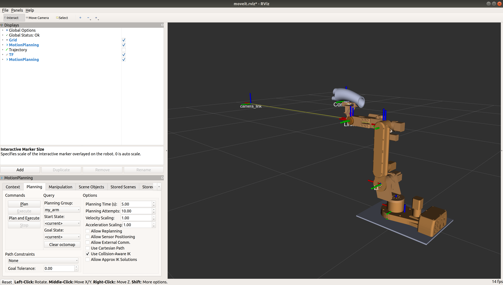

# Autonomous Vehicle Charging Arm


This repository contains the simulation of a custom 6 DOF robotic manipulator designed to autonomous electric vehicles. 

The project utilizes Python, ROS, RViZ, Gazebo, and MoveIT. It was also linked to the hardware using an Arduino.

This repository attempts to provide a comprehensive description on how to get the project running. This could assist in providing a general description on how to apply the same process to custom robot manipulators.

This can help you gain experience with some nice features of ROS and MoveIt: robot description using [urdf](http://wiki.ros.org/urdf/XML), simulation in [Gazebo](http://gazebosim.org/), joint-space control based on the inverse dynamic model of the arm with help of the [KDL](http://www.orocos.org/kdl) library, trajectory control with [ROS Control](http://wiki.ros.org/joint_trajectory_controller), finally inverse kinematics and planning with [MoveIt!](http://moveit.ros.org/), and linking with hardware using Arduino and ROS.

**[RViz](http://wiki.ros.org/rviz)** with the **[MoveIt! plugin](http://docs.ros.org/kinetic/api/moveit_tutorials/html/doc/ros_visualization/visualization_tutorial.html)**



___

#### Usage
Install dependencies:
```
rosdep install --from-paths src --ignore-src -r -y
```
Build catkin workspace:
```
catkin_make
```
Init the environment:
```
source devel/setup.sh
```
Launch the gazebo simulation:
```
roslaunch arm_gazebo empty_world.launch
```
Launch the controller along with RViz:
```
roslaunch arm_control rviz.launch
```
Launch the MoveIt! move group:
```
roslaunch arm_control moveit.launch
```
You can now use the MoveIt! plugin in Rviz to control the arm.
___

